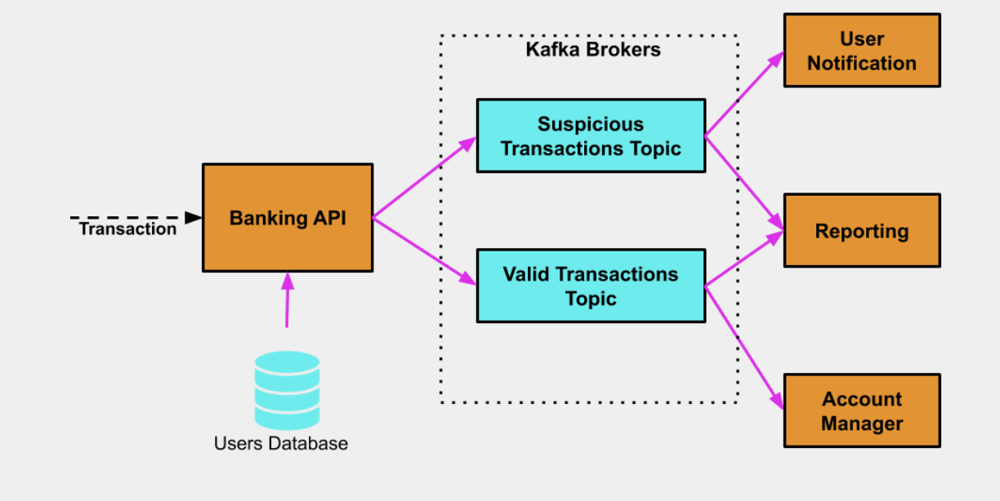

# Distributed Banking System project

In this exercise we will build a Distributed Banking System

----------

## Background
Let's assume we have a large number of users. Each user has an account with our bank and was also issued a credit card to make purchases in stores.

If our bank suspects a particular purchase transaction may be fraudulent, that transaction is flagged and sent to the user as a notification to approve or reject.

The way our security detects suspicious transactions is by comparing the user's country of residence and the location from which the transaction was made. If the user's residence country and the transaction's location don't match, the transaction is flagged.

## Architecture
In our distributed system we will have multiple micro-services.

### Banking API Service 
- Receives credit card transactions from online and physical stores. Each transaction contains the following information

- User - the user who (allegedly) made the purchase in that particular store

- Amount - the amount of the purchase transaction in dollars

- Transaction location - the country in which that purchase has been made

- Users Database - A database where we store each of our bank users' residence location

### User Notification Service 
- For every transaction this service receives, it sends a notification to the user who allegedly made the purchase with a request to log in the banking web site and confirm or reject the transaction

### Account Manager Service 
- Every transaction that this service receives is a valid transaction. The service authorizes the transaction and transfers the money from the user's account to the store where the purchase was made

### Reporting Service 
- For every transaction that has been processed by the Banking API Service, the Reporting Service stores the transaction for:

- Further investigation (if it is a suspicious transaction) or;

- For the user's monthly statement (if it is a valid transaction)

All the communication inside our Distributed System is done through Kafka Topics

--------------

## Execution

### Part 1 - Launching Kafka
##### Instructions on Starting Kafka to our computer we will start with configuring Apache Zookeeper:

1. Create zookeeper-logs directory `mkdir zookeeper-logs`

2. Open config/zookeeper.properties and modify dataDir to point to zookeeper-logs (full path)

3. Run Zookeeper `/bin/zookeeper-server-start.sh kafka/config/zookeeper.properties`

4. Create 3 directories, one for each Kafka broker logs: `mkdir kafka-logs-0`, `mkdir kafka-logs-1`, `mkdir kafka-logs-2`. Each directory will contain the corresponding Kafka broker's logs.

5. Create 2 copies of  config/server.properties and name them config/server-1.properties and config/server-2.properties. Rename the original config/server.properties to config/server-0.properties.

6. Change each configuration file's log.dirs to point to the corresponding kafka-logs-X directory:

- In config/server-0.properties change log.dirs  to point to kafka-logs-0

- In config/server-1.properties change log.dirs  to point to kafka-logs-1

- In config/server-2.properties change log.dirs  to point to kafka-logs-2

7. In server-1.properties uncomment the #listeners=PLAINTEXT://:9092 and change the port to 9093 `listeners=PLAINTEXT://:9093`

8. In server-2.properties uncomment the #listeners=PLAINTEXT://:9092 and change the port to 9094 `listeners=PLAINTEXT://:9094`

Now our all our 3 Kafka broker's configuration files are ready so we go ahead to run the brokers

