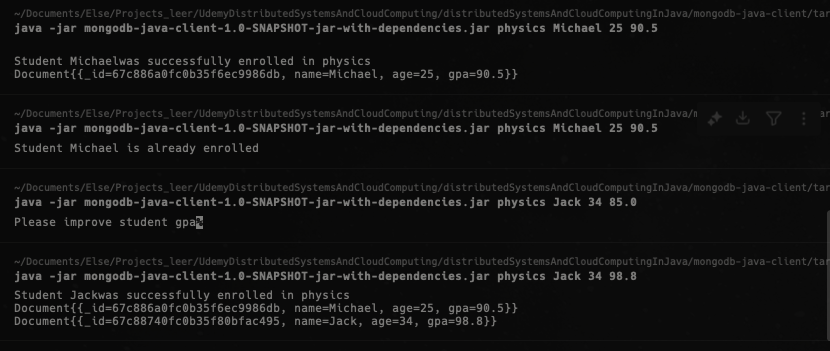
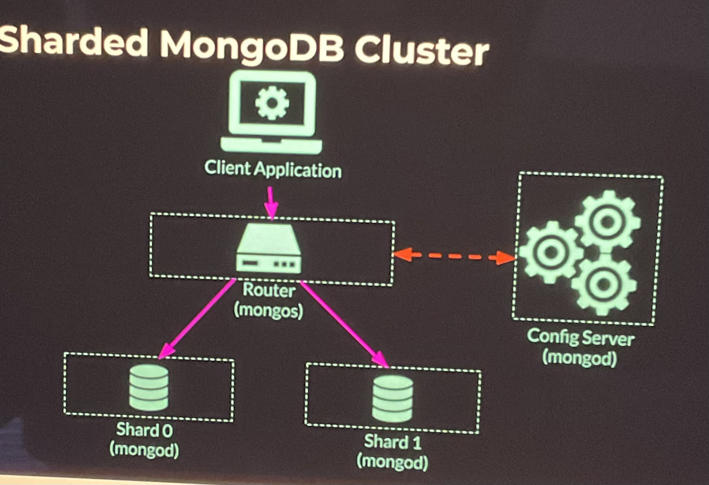

## Install MongoDB and run
- `brew tap mongodb/brew`
- `brew install mongodb-community@8.0`
- `brew services`
- `brew services start mongodb-community`
- `cat /opt/homebrew/etc/mongodb.conf`
- `ps aux | grep -v grep | grep mongodb` to check if mongodb is running. 
- `mongod --version`
- `mongosh` to connect to the mongodb terminal.
-------------------

## Commands - 1 

- `help` lists all available commands for us to try.
-  `show dbs`
- `use <db_name>` is that db is not there, mongodb will create it. Here, lets use the db_name as `online-school`.
- show collections.
- `db.students.insertOne({"name":"Michael", "age" : 25, favorite_colors:["blue", "yellow"]});` with this first entry, collection `student` will also be created.
- `db.students.find();`
-  `db.students.insertOne({"_id":"5bd" , "name":"Jackie", "age" : 35, favorite_colors:["green"]});` better not to use custom _id and let mongodb choose it for us.
- `db.students.insertMany([{"name":"John", "age" : 41, favorite_colors:["black"]}, {"name":"Mary", "age" : 5, favorite_colors:["white", "blue", "green"]}]);` to insert more entries.
- `db.students.find().pretty()` to view data better.
- `db.students.find({ name: "Michael"});` fetch all students with name Michael.
- `db.students.find({age:{$gt: 30}});` fetch all students with age greater than 30.
- `db.students.find( { $or : [ {favorite_colors:"blue"} , {favorite_colors: "black"}] } );` query inside an array field.
- `db.students.find( { $or : [ {favorite_colors:"blue"} , {favorite_colors: "black"}] } ).limit(1);` show only 1 result.
- `db.students.updateOne({name: "Jackie"}, {$set: {age:32}})`; update a field in an entry in students' collection.
-  `db.students.find({name: 'Jackie});` check if the age has updated.
-  `db.students.find();`
- `db.students.deleteMany({age:{$lt:18}});` delete all students whose age is less than 18.
-  `db.students.find();` check if collection has updated.

## mongodb-java-client application 
### Scaling MongoDB using Data Replication
- A Java client application that cn read and write to our cluster through the MongoDB Java Driver library.
- Reference url: https://www.mongodb.com/docs/manual/core/replica-set-write-concern/


- `mkdir -p /opt/homebrew/var/mongodb/rs0-0`
- `mkdir -p /opt/homebrew/var/mongodb/rs0-1`
- `mkdir -p /opt/homebrew/var/mongodb/rs0-2`
- `mongod --replSet rs0 --port 27017 --bind_ip 127.0.0.1 --dbpath /opt/homebrew/var/mongodb/rs0-0 --oplogSize 128`
- `mongod --replSet rs0 --port 27018 --bind_ip 127.0.0.1 --dbpath /opt/homebrew/var/mongodb/rs0-1 --oplogSize 128`
- `mongod --replSet rs0 --port 27019 --bind_ip 127.0.0.1 --dbpath /opt/homebrew/var/mongodb/rs0-2 --oplogSize 128`
- `mongosh --port 27017`
    ```json
        rs.initiate({
        _id: "rs0",
        members: [
            { _id: 0, host: "127.0.0.1:27017" },
            { _id: 1, host: "127.0.0.1:27018" },
            { _id: 2, host: "127.0.0.1:27019" }
        ] 
        })

    ```

- `mongosh --port 27017` connecting to this port to see if its primary and it is. Also check 27018, 27019

- build a java client application to test this above built mongodb cluster

- `java -jar mongodb-java-client-1.0-SNAPSHOT-jar-with-dependencies.jar physics Michael 25 90.5`
    - output says "Invalid course physics" - this is because we might not have physics course in db.
    - `mongosh --port 27017`
    - `show dbs`
    - `use online-school` creates a new db
    -  `db.createCollection("physics")` creates a new collection in online-school
    - `show collections`

 

### Failure Injection and testing (contd. from above)

- kill the primary replication node ctrc+c the node running on port 27017 (note that this is our primary node)
- To check if the secondaries at 27018, 27019 have done the leader election and chose a leader, do `mongosh --port 27018` and `mongosh --port 27019`
    - node running on 27108 now acts as primary and 27019 acts as secondary
- now, if we add a new student entry, the cluster will still add it since the write concern is the primary node and we do have a primary node at this point.


## Sharded Distributed MongoDB Cluster (insert-many-users, insert-many-movies)

- This cluster would have two shards.

### 
- Need to launch our config server cluster. So, we need three directories, one for each config server replication set member.
    - `mkdir -p /opt/homebrew/var/mongodb/config-srv-0`
    - `mkdir -p /opt/homebrew/var/mongodb/config-srv-1`
    - `mkdir -p /opt/homebrew/var/mongodb/config-srv-2`

- Now, lets launch the config servers mongod instances. Set the replication set to config-rs. Bind to local host. Use Three terminals. This step is completely identical to the above running a regular MongoDB replication set except the role of those mongod instances was set to config server.
    - Run the first config server mongod instance `mongod --configsvr --replSet config-rs --dbpath /opt/homebrew/var/mongodb/config-srv-0 --bind_ip 127.0.0.1 --port 27020`
    - Run the second config server mongod instance `mongod --configsvr --replSet config-rs --dbpath /opt/homebrew/var/mongodb/config-srv-1 --bind_ip 127.0.0.1 --port 27021`
    - Run the third config server mongod instance `mongod --configsvr --replSet config-rs --dbpath /opt/homebrew/var/mongodb/config-srv-2 --bind_ip 127.0.0.1 --port 27022`

- Group the above created config servers together into a single replicated cluster
    - lets connect to one of them `mongosh --port 27020`.
        ```json
        rs.initiate(
            {
            _id: "config-rs",
            configsvr: true,
            members: [
                { _id: 0, host: "127.0.0.1:27020" },
                { _id: 1, host: "127.0.0.1:27021" },
                { _id: 2, host: "127.0.0.1:27022" }
                ] 
            }
        )
        ```
- Launching actual MongoDB shards. we are going to run two standalone shards
    - create directories for shards
        - `mkdir -p /opt/homebrew/var/mongodb/shard-0`
        - `mkdir -p /opt/homebrew/var/mongodb/shard-1`
    - Run above shards. Run the mongod instance but with shard server parameter. Use 2 terminals
        - `mongod --shardsvr --port 27017 --bind_id 127.0.0.1 --dbpath /opt/homebrew/var/mongodb/shard-0 --oplogSize 128`
        - `mongod --shardsvr --port 27018 --bind_id 127.0.0.1 --dbpath /opt/homebrew/var/mongodb/shard-1 --oplogSize 128`
    - Now on a new terminal, we need our mongo s router to put everything together. Ask it to listen on port 27023
        - `mongos --configdb config-rs/127.0.0.1:27020,127.0.0.1:27021,127.0.0.1:27022 --bind_id 127.0.0.1 --port 27023`
    - Now, we have everything put together. Check the cluster architecture diagram below
        -  
    - Now, need to tell mongos about these two shards
        - `mongosh --port 27023`
        - add first shard `sh.addShard("127.0.0.1:27017)`
        - add second shard `sh.addShard("127.0.0.1:27018)`
        - `show dbs`
        - `use config` switch to config database
        -  Now, we'll experiment with the balancing feature. So, change the chunk size from original 128 MB to 1MB. It's not needed in production but here we do it because to see the result my putting in a few documents.
            - `db.settings.save( {_id:"chunksize", value: 1} )`

- Video on Demand online streaming service Use case to practice above sharding.
    - User can search movie by name or scroll the list of movies alphabetically.
    - DB should have two collections. (movies, users)
    - Task is to shard these collections in a scalable way it would allow our business to grow and keep our users happy.
    - #### Movies Collection (Sharding using range strategy)
        - Movies collection document has data like the following: 
             ```json
                {
                    "name": "Pulp Fiction",
                    "directors": [
                        "Quentin Tarantino"
                    ],
                    "year": 1994,
                    "cast": [
                        "Amanda Plummer",
                        "Samuel L. Jackson",
                        "Tim Roth",
                        "Bruce Willis",
                        "John Travolta",
                        "Uma Thurman"
                    ],
                    "rating": 10.0
                }
            ```          
        -  `mongosh --port 27023`
        - create a video db `use videodb`
        - enable sharding `sh.enableSharding("videodb")` this allows us to shard collections within it.
        - `db.movies.insertOne({ "name": "Pulp Fiction", "directors": [ "Quentin Tarantino" ], "year": 1994, "cast": [ "Amanda Plummer", "Samuel L. Jackson", "Tim Roth", "Bruce Willis", "John Travolta", "Uma Thurman"], "rating": 10.0})`
        - `db.movies.insertOne({ "name": "Moana", "directors": [ "Ron Clements", "john Musker", "Don Hall", "Chris Williams"], "year": 2016, "cast": [ "Auli'i Dwayne Johnson", "Rachel House", "Temuera Morrison", "Jemaine Clement", "Nicole SCherzinger", "Alan Tudyk", "Oscar Kightley", "Troy Polamalu", "Puanani Cravalho", "Louise Bush" ], "rating": 9.9})`
        - At this moment, the collection has two documents but this collection hasn't yet been sharded. User query contains movie's name or query contains an alphabetic range of moie names.
        - Shard movies collection using movie's name
            - Sharding key will be present in the router and our mongos souter will know to which shard to direct the query rather than to broadcast it to all shards. ex: `db.movies.find({name:"Pulp Fiction"})`
        - Shard the movies collection based on range based strategy
            - If a query asks to fetch movies that start with the letter P, they will much more likely to be on the same shard which will make our query very fast. ex: `db.movies.find({name:"{$regex:^P}"})`
        - Create an index on the column "name" since this is a prerequisite to shard the collection on this key. Index is a database structure that pre-computes some data about a particular filed in a collection ahead of time. Typically, it pre sorts or pre hashes the documents based on the given field to make queries involving this field more efficient.
            - `db.movies.createIndex({ name: 1})` this index pre-sorts our names in ascending order.
        - Now once we have the index the field we want to shard on , we need to run the shard collection command with the full collection name in the field we want to shard on.
            - `sh.shardCollection("videodb.movies", {name : 1})` . here, 1 indicates that we are sharding using range-based strategy. Since we already pre-sorted them alphabetically, now with sharding, they will be broken into chunks but the names order stays the same.
        - `sh.status()` to get more information of how our present collection has sharded. Check the shards section. There will be 2 active shards in our cluster at this point. And video db information located at the bottom. There it can be seen that the at present our entire collection is currently located in shard 1 and contains only chunk since we have only two documents (minimum name value -> maximum name value).
        - Now, lets add alot more documents into our collection.
            - go to *insert-many-movies* java application.
            - It simply connects to the MongoDB cluster using mongos.
            - Once the connection is successfull, we generate 10,000 movies and place all of them in our movies collection.
            - Run the application.
        - Now, we can see 10,000 new documents in our video db collection and a full rebalancing of our chunks among the previous two shards created.
        - `sh.status()` to look at our new chunks distribution. And previously, we set the maximum size for a chunk as 1MB, now that we have 10,000 entries, we definitely increased that threshold. So now we have 15 chunks of documents in our collection. We can also see, our balancer placed 7 of them in shard0000 and 8 in shard0001. We can also see the exact range of names in each chunk and these names are sorted in alphabetic order just like we expected.
        - So now if we want to query all movies that start with letter 'F' , they will all be in the same shard0000 despite being spread in 3 chunks.


    - #### Users Collection (Sharding using hashed stragegy)
        - Users collection has document data like the following
            ```json
                {
                    "user_name": "John Smith",
                    "watched_movies": [
                        "Aladdin",
                        "Spider Man"
                    ],
                    "favorite_genres":[
                        "cartoon",
                        "action",
                        "horror"
                    ],
                    "subscription_month":8
                }
            ```
        - User collection observation 
            - Each time a user watches a movie, the document gets update.
            - We expect to read and update existing documents frequently.
            - We expect our collection to grow over time.
            - Any read, update or addition involves only one user.
        - why we need to use Hash based strategy for this
            - No need for groups of users to be co-located
            - We want even and random distribution of users across the shards for better reads and write across the whole cluster.
        - User-names are not uniformly distributed.
        - Document IDs (genrated by MongoDB) are random and uniformly distributed and are an excellent candidate for sharding key.
        - We need to refer to the user by ID to make queries like read and write efficient.
        - go back to mongos instance if not still connected -> `mongosh --port 27023`
        - `use videodb` to connect to our database.
        - add some users to our users collection
            - `db.users.insertOne({ "user_name": "John Smith", "watched_movies": [ "Aladdin", "Spider Man" ], "favorite_genres":[ "cartoon", "action", "horror" ], "subscription_month":8 } )`
            - `db.users.insertOne({ "user_name": "Edward Stark", "watched_movies": [ "Moana", "Pulp fiction", "The Notebook" ], "favorite_genres":[ "romance", "action", "comedy" ], "subscription_month":8 } )`
        - `db.users.find().pretty()` we now have two users with two randomly generted ids of type '_id' by mongoDB. Each object _id contains a 12Byte value shown to us in a hexadecimal format.
        - Now, lets shard the users' collection using the hash sharding strategy
            - Create index like before but this time, index will prehashes the values of our userids `db.users.createIndex( { _id:"hashed" } )`
            - Shard collection `sh.shardCollection("videodb.users", { _id: "hashed" } )`
        -  When we do `sh.status(true)`, we can see that currently we only have once chunk of users containing all our data. We have only two documents in our collection right now.
        - Now, open the inser-many-users java application
            - It simply connects to the MongoDB cluster using mongos.
            - Once the connection is successfull, we generate 10,000 users and place all of them in our users collection.
            - Run the application.
        - Run `sh.status(true)` to see users chunks and their distribution across two shards shard0000, shard0001. 
            - There are 20 chunks created
            - At first, we can see 5 chunks are assigned to shard0001 and 15 to shard0002. In the background, the loadbalancer is still balancing both of them. Do this status check in a few seconds to see both the shards would have approximately 10 chunks each. But it is also highly possible that mongodb can do chunk split and the number of chunks will also be increased before getting assigned to a different shard. So, we might also have more than 10 chunks. 
            - hash function is applied on user _id and we can see their hash ranges.

        
            
    - #### Video Streaming - System Evolution
        - ##### Movies 
            1. As our service becomes more popular, we start getting more read queries for all the movies that means our load increases evenly on all the shards.
                - So, we can increase the number of shards. This will decrease the load on each shard and keep our distributed system stable.
            2. Our load increases but one or a few movies are way more popular than the rest and are getting disproportionately large number of queries.
                - In this case, adding more shards will not solve the problem as we have a clear hotspot in our data set.
                - So, instead of increasing shards, we can increase the size of our replication set and in addition, use the readpreference as "SecondaryPreferred".
                - This way, we will spread the queries among all the nodes in teh shards replication sets as they all contain the same data for that particular movie.
                - This approach will work well because our movies data is almost static and doesn't change very often (Eventual consistency). We don't need to guarantee strict consistency in this use case.
        - ##### Users
            1. When it comes to scaling our users collection, is actually a lot simpler.
                - It the number of users keeps increasing and we are getting more logins from existing users and signups from new users, simply increase the number of shards.
                - As our userIds are uniformly distributed, we are guaranteed to not have any hotspots in our distributed database (dDB).

